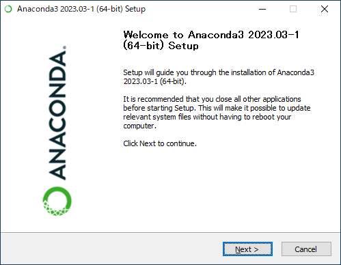
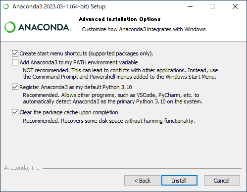

Anacoda 2019.03 インストール方法
========================================

この文書は，初心者向けに情報提供を目的に書かれたものです．
既に Python を使用中の場合は，この手順でインストールすることにより環境を破壊する可能性があるので注意して下さい．

1. Anaconda の配布サイトへ

    配布サイト：[https://www.anaconda.com/distribution/#download-section](https://www.anaconda.com/distribution/#download-section)

2. 適切なOS種別ごとのインストーラを入手する 
    
    最上部の (Windows / macOS / Linux) を選択した後， "Python 3.7 version" の Download ボタンを押下する（ 2.7 は，終息予定なのでNG．必ず 3.7 を使用して下さい）．
    

3. macOSの人は4.へ，Windowsの人は，5.へ

4. **macOSの場合**：ダウンロードしたpkgファイルを開いて，ひたすら "続ける" ボタンを押下する．

    途中，ライセンスの "同意" や "自分専用にインストール" を選択する．
    最後は，"ゴミ箱に入れる" でOK．

    

    
    
    
    
    
    
    
    
    
    
    
    
    
    
    

以上

5. **Windowsの場合**：ダウンロードしたインストーラのexeファイルを開く．

    以下の注意点に気をつけながら，ひたすら "次へ(Next)" ボタンを押下する．
    途中，ライセンスの "同意(Agree)" や "自分専用にインストール(Just Me)" を選択する．
    
    **重要なお知らせ**

    * Advanced Options のチェックボックスについて
      * "Add Anaconda to the system PATH environment variable" のチェックは，推奨しない．しかし，以下の条件を全て満たす場合のみ，つけておくと初心者には便利です（自己責任）．もちろん，条件を満たさない場合は，チェックをつけてはいけません．
        * 初めてPythonをインストールする
        * 他のソフトやツールで Python を使用していない
        * 今後，複数バージョンの Python を同時に使用する予定がない
      * "Register Anaconda as the system Python 3.6" のチェックは，原則としてつけたままで良い．
    
    * Thanks for installing Anaconda! のチェックボックスについて
      * "Learn more about Anaconda Cloud" のチェックは，外す．
      * "Learn more about Anaconda Support" のチェックは，外す．

    
    Next 押下

    
    I Agree 押下
    
    
    Just Me, Next 押下
    
    
    Next 押下
    
    
    チェックボックスの状態に要注意, Next 押下
    
    
    Next 押下
    
    
    Next 押下
    
    
    両方チェックボックスを外す, Finish 押下

以上